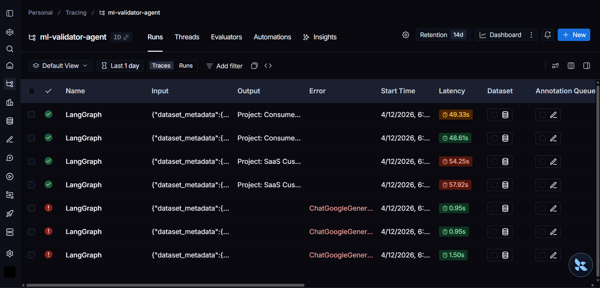
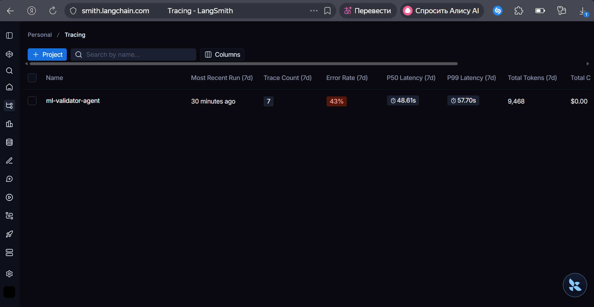
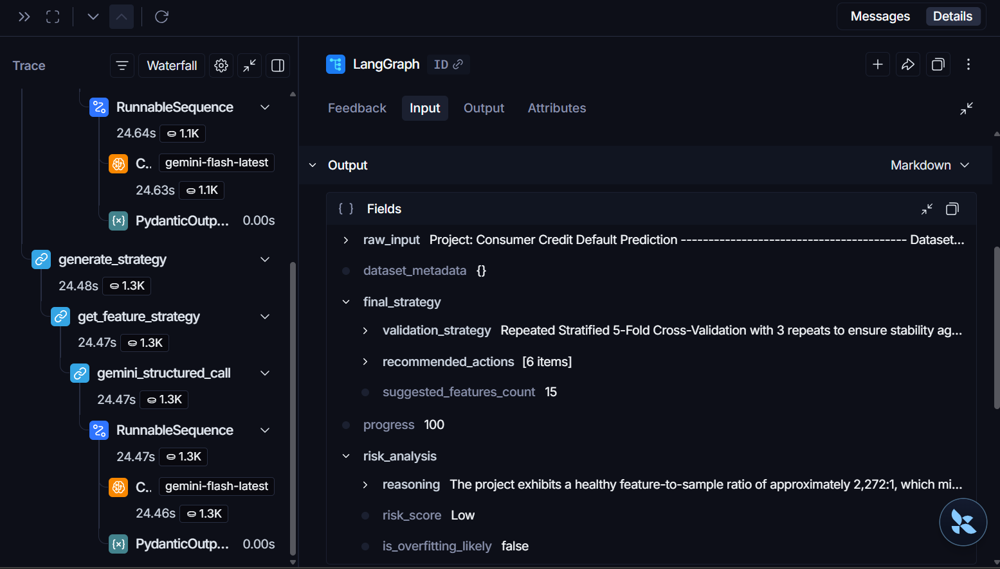

# ML Validator Agent

An automated AI-driven pipeline built with **LangGraph** to audit Machine Learning project metadata. This agent identifies statistical risks (like data leakage and overfitting) and generates a structured feature engineering roadmap.

## Key Features

- **Multi-Node Architecture**: Built using a directed state graph with 3 functional nodes.
- **Agentic Reasoning**: Uses **Gemini 2.0 Flash** to perform deep analysis across different roles (Senior Data Scientist & ML Engineer).
- **Structured Outputs**: Fully integrated with **Pydantic** to ensure 100% valid JSON deliverables.
- **Professional Monitoring**: Powered by **LangSmith** for real-time tracing and observability.
- **Robustness**: Includes automatic retry logic for handling API spikes (e.g., 503 errors).

## Workflow Architecture

The system follows a sequential pipeline defined in `graph.py`:
1. **Ingest Data**: Reads raw metadata from `input_data.txt`.
2. **Analyze Risks**: LLM identifies statistical flaws, class imbalances, and potential leakage.
3. **Generate Strategy**: LLM creates a technical roadmap based on identified risks.

## Tech Stack

- **Framework**: LangGraph
- **LLM**: Google Gemini 2.0 Flash
- **Data Validation**: Pydantic V2
- **Tracing**: LangSmith
- **Environment**: Python 3.14+

## LangSmith Observability Evidence

We use **LangSmith** for deep monitoring and tracing of our Agent's reasoning path. Below is the evidence of successful execution.

### 1. Agentic Reasoning Flow (The Waterfall)
*This crucial view proves the implementation of 3 distinct functional nodes (`ingest_data`, `analyze_risks`, `generate_strategy`), fulfilling assignment requirements.*


*(Note: If screenshots/2.png is not the waterfall view, replace '2.png' with the correct number).*

### 2. Execution History
*A log of multiple successful runs validating different ML project scenarios.*



### 3. Pipeline Statistics (Debugging Phase)
*Overall statistics showing latency and tokens. The error rate reflects the initial debugging phase where we fine-tuned prompts and Pydantic schemas.*



## Setup & Execution

1. **Clone the repo**:
   ```bash
   git clone <your-repo-link>
   cd ml-validator-agent

2. Install dependencies:
   pip install langgraph langchain-google-genai pydantic python-dotenv

3. Environment Variables:
  Create a .env file with your keys:
  GOOGLE_API_KEY=your_key_here
  LANGSMITH_API_KEY=your_key_here
  LANGSMITH_TRACING=true
  LANGSMITH_PROJECT=ml-validator-agent

4. Run the Agent:
   python main.py

